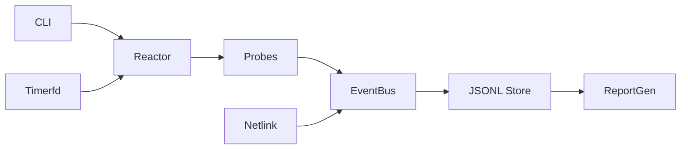

# Architecture
- Single epoll reactor with timerfd scheduler.
- Probes implement start/stop/tick and emit events via EventBus.
- EventBus fan-outs to JSONL store and future in-memory stats.
- Report generator reads manifest + events to HTML (self-contained).

Module diagram:

